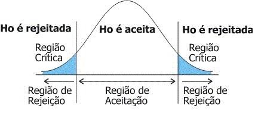
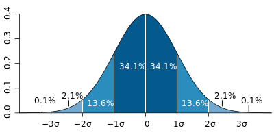

statistical_tests.R
========================================================
author: JEST
date: 25/04/2018
autosize: true
<style>
body {
    overflow: scroll;
}
</style>

Porquê testes estatísticos?
=======================================================


  Correlação não implica causalidade!

http://www.tylervigen.com/spurious-correlations

Tipos de Variáveis 
========================================================

- Quantitativas - representam variáveis que podem ser medidas numa escala quantitativa
  - Discretas - Ex: número de filhos, idade...
  - Contínuas - EX: peso, altura...
- Qualitativas - representam variáveis definidas por várias categorias
  - Nominais - Ex: sexo, cor dos olhos...
  - Ordinais - Ex: escolaridade, mês...
  

Tipos de Amostras
========================================================

- Emparelhadas
  - Variáveis emparelhadas sao aquelas que estao associadas a medições sobre os mesmos sujeitos (p.e. medições ao longo do tempo)
- Independentes
  - Variáveis independentes sao aquelas que nao dependem de valores de outras observações (p.e. testes ao sangue a dois grupos de pessoas diferentes)


Dataset
========================================================


```r
# https://www.kaggle.com/osmi/mental-health-in-tech-survey
library(dplyr)
library(tidyr)
dataset <- read.csv("survey.csv", header = T)
summary(dataset)
```

```
               Timestamp         Age                 Gender   
 2014-08-27 12:31:41:   2   Min.   :-1.726e+03   Male   :615  
 2014-08-27 12:37:50:   2   1st Qu.: 2.700e+01   male   :206  
 2014-08-27 12:43:28:   2   Median : 3.100e+01   Female :121  
 2014-08-27 12:44:51:   2   Mean   : 7.943e+07   M      :116  
 2014-08-27 12:54:11:   2   3rd Qu.: 3.600e+01   female : 62  
 2014-08-27 14:22:43:   2   Max.   : 1.000e+11   F      : 38  
 (Other)            :1247                        (Other):101  
           Country        state     self_employed family_history treatment
 United States :751   CA     :138   No  :1095     No :767        No :622  
 United Kingdom:185   WA     : 70   Yes : 146     Yes:492        Yes:637  
 Canada        : 72   NY     : 57   NA's:  18                             
 Germany       : 45   TN     : 45                                         
 Ireland       : 27   TX     : 44                                         
 Netherlands   : 27   (Other):390                                         
 (Other)       :152   NA's   :515                                         
   work_interfere         no_employees remote_work tech_company
 Never    :213    1-5           :162   No :883     No : 228    
 Often    :144    100-500       :176   Yes:376     Yes:1031    
 Rarely   :173    26-100        :289                           
 Sometimes:465    500-1000      : 60                           
 NA's     :264    6-25          :290                           
                  More than 1000:282                           
                                                               
       benefits     care_options   wellness_program      seek_help  
 Don't know:408   No      :501   Don't know:188     Don't know:363  
 No        :374   Not sure:314   No        :842     No        :646  
 Yes       :477   Yes     :444   Yes       :229     Yes       :250  
                                                                    
                                                                    
                                                                    
                                                                    
      anonymity                  leave     mental_health_consequence
 Don't know:819   Don't know        :563   Maybe:477                
 No        : 65   Somewhat difficult:126   No   :490                
 Yes       :375   Somewhat easy     :266   Yes  :292                
                  Very difficult    : 98                            
                  Very easy         :206                            
                                                                    
                                                                    
 phys_health_consequence        coworkers          supervisor 
 Maybe:273               No          :260   No          :393  
 No   :925               Some of them:774   Some of them:350  
 Yes  : 61               Yes         :225   Yes         :516  
                                                              
                                                              
                                                              
                                                              
 mental_health_interview phys_health_interview  mental_vs_physical
 Maybe: 207              Maybe:557             Don't know:576     
 No   :1008              No   :500             No        :340     
 Yes  :  44              Yes  :202             Yes       :343     
                                                                  
                                                                  
                                                                  
                                                                  
 obs_consequence
 No :1075       
 Yes: 184       
                
                
                
                
                
                                                                                                                                                                                comments   
 * Small family business - YMMV.                                                                                                                                                    :   5  
 -                                                                                                                                                                                  :   1  
                                                                                                                                                                                    :   1  
 (yes but the situation was unusual and involved a change in leadership at a very high level in the organization as well as an extended leave of absence)                           :   1  
 A close family member of mine struggles with mental health so I try not to stigmatize it. My employers/coworkers also seem compassionate toward any kind of health or family needs.:   1  
 (Other)                                                                                                                                                                            : 155  
 NA's                                                                                                                                                                               :1095  
```

Exercício 1
======================================================

Faça load do dataset como visto no módulo prévio, e indique qual o tipo das variáveis:
- "Country"
- "no_employees"
- "tech_company"


Hipótese Nula
=======================================================

Esta e uma hipótese apresentada, cuja falsidade se tenta provar através do teste estatístico adequado para as variáveis presentes. Esta pode ser rejeitada atraves do p-value.

Exemplo:
- H<sub>0</sub> - A terra não é redonda


p-value
======================================================

- Este é utilizado para determinar a significância dos resultados.
- Se o p-value for menor do que $\alpha$, a hipótese nula é rejeitada.

<div align="center">

</div>

Testes de Normalidade
======================================================
Entre os vários testes estatísticos que iremos aprender mais à frente, alguns exigem a normalidade dos dados, isto é, que estes apresentem uma distribuição normal.

<div align="center">

</div>

Testes de Normalidade
=====================================================

- n>20 - Teste Kolmogorov-Smirnov
A hipótese nula deste teste 

```r
ks.test(dataset$Age, "pnorm")
```

```

	One-sample Kolmogorov-Smirnov test

data:  dataset$Age
D = 0.99762, p-value < 2.2e-16
alternative hypothesis: two-sided
```

Testes de Normalidade
====================================================
- n<=20 - Teste Shapiro-Wilk

```r
shapiro.test(dataset$Age)
```

```

	Shapiro-Wilk normality test

data:  dataset$Age
W = 0.0098142, p-value < 2.2e-16
```


======================================================
<script src="https://ajax.googleapis.com/ajax/libs/jquery/3.1.1/jquery.min.js"></script>
<script>

for(i=0;i<$("section").length;i++) {
if(i==0) continue
$("section").eq(i).append("<p style='font-size:medium;position:fixed;right:10px;bottom:10px;'>" + i + "</p>")
}

</script>
