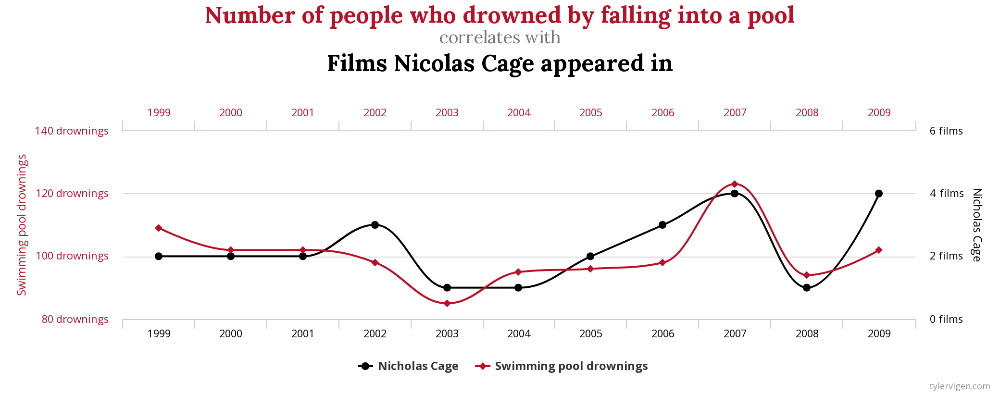

statistical_tests.R
========================================================
author: JEST
date: 25/04/2018
autosize: true

<style>
body {
    overflow: scroll;
}
</style>

Porquê testes estatísticos?
=======================================================


  Correlação não implica causalidade!

http://www.tylervigen.com/spurious-correlations

Tipos de Variáveis 
========================================================

- Quantitativas - representam variáveis que podem ser medidas numa escala quantitativa
  - Discretas - Ex: número de filhos, idade...
  - Contínuas - EX: peso, altura...
- Qualitativas - representam variáveis definidas por várias categorias
  - Nominais - Ex: sexo, cor dos olhos...
  - Ordinais - Ex: escolaridade, mês...
  

Tipos de Amostras
========================================================

- Emparelhadas
  - Variáveis emparelhadas sao aquelas que estao associadas a medições sobre os mesmos sujeitos (p.e. medições ao longo do tempo)
- Independentes
  - Variáveis independentes sao aquelas que não dependem de valores de outras observações (p.e. testes ao sangue a dois grupos de pessoas diferentes)


Exercício 1
======================================================

Faça load do dataset (https://www.kaggle.com/osmi/mental-health-in-tech-survey/data) survey.csv em (jest.pt/R/survey.csv) como visto no módulo prévio, e indique qual o tipo das variáveis:
- "Country" (país da pessoa em causa)
- "no_employees" (número de empregados da empresa)
- "work_interfere" (se a condição mental interfere com o tabalho)


Hipótese Nula
=======================================================

Esta e uma hipótese apresentada, cuja falsidade se tenta provar através do teste estatístico adequado para as variáveis presentes. Esta pode ser rejeitada através do p-value.

Exemplo:
- H<sub>0</sub> - A terra não é redonda.

Normalmente a hipótese nula é formulada na forma negativa. No entanto, mesmo que esta seja rejeitada, não significa necessariamente que aceitamos a hipótese alternativa, apenas que não a podemos rejeitar.

- H<sub>1</sub> - A terra é redonda.

p-value
======================================================

- Este é utilizado para determinar a significância dos resultados.
- Se o p-value for menor do que $\alpha$, a hipótese nula é rejeitada.
- Em geral, o $\alpha$ utilizado é 0.05 .

<div align="center">

</div>

Testes de Normalidade
======================================================
Entre os vários testes estatísticos que iremos aprender mais à frente, alguns exigem a normalidade dos dados, isto é, que estes apresentem uma distribuição normal.

<div align="center">

</div>


Testes de Normalidade - Dataset Iris
========================================================


```r
library(dplyr)
library(tidyr)
library(datasets)
# A library datasets contém um dataset sobre plantas guardado na variavel iris
summary(iris)
```

```
  Sepal.Length    Sepal.Width     Petal.Length    Petal.Width   
 Min.   :4.300   Min.   :2.000   Min.   :1.000   Min.   :0.100  
 1st Qu.:5.100   1st Qu.:2.800   1st Qu.:1.600   1st Qu.:0.300  
 Median :5.800   Median :3.000   Median :4.350   Median :1.300  
 Mean   :5.843   Mean   :3.057   Mean   :3.758   Mean   :1.199  
 3rd Qu.:6.400   3rd Qu.:3.300   3rd Qu.:5.100   3rd Qu.:1.800  
 Max.   :7.900   Max.   :4.400   Max.   :6.900   Max.   :2.500  
       Species  
 setosa    :50  
 versicolor:50  
 virginica :50  
                
                
                
```

Testes de Normalidade
=====================================================

- Teste Kolmogorov-Smirnov

A hipótese nula deste teste é que a amostra é retirada da distribuição de referência. Logo, se o p-value for menor que 0.05, rejeitamos a hipótese nula, e verificamos que a distribuição da amostra não é retirada da distribuição de referência.

```r
ks.test(iris$Sepal.Length, "pnorm")
```

```

	One-sample Kolmogorov-Smirnov test

data:  iris$Sepal.Length
D = 0.99999, p-value < 2.2e-16
alternative hypothesis: two-sided
```

Este teste não é tão poderoso como o próximo.

Testes de Normalidade
====================================================

- Teste Shapiro-Wilk

A hipótese nula deste teste é que a distribuição da amostra é normal. Logo, se o p-value for menor que 0.05, rejeitamos a hipótese nula, e verificamos que a distibuição não é normal.

```r
shapiro.test(iris$Sepal.Length)
```

```

	Shapiro-Wilk normality test

data:  iris$Sepal.Length
W = 0.97609, p-value = 0.01018
```

Como o p-value é 0.01, rejeita-se a hipótese nula.

Testes de Normalidade
====================================================

Se quisessemos aplicar o teste de normalidade ao grupo de plantas versicolor, teríamos de fazer:


```r
shapiro.test(iris[iris$Species == "versicolor",]$Sepal.Width)
```

```

	Shapiro-Wilk normality test

data:  iris[iris$Species == "versicolor", ]$Sepal.Width
W = 0.97413, p-value = 0.338
```


Exercício 2
====================================================
-No dataset survey.csv, verifique se a variável Age segue uma distribuição normal. Indique qual a hipótese nula do teste, e se esta foi rejeitada ou não.

Testes Estatísticos
=====================================================

<div align="center">

</div>

- Um teste paramétrico assume que as amostras seguem uma distribuição específica 
- Um teste não paramétrico não assume nenhuma distribuição das amostras.

Testes Estatísticos
===================================================
<div align="center">

</div>


Testes Estatísticos - ANOVA
====================================================

Começando pelo teste ANOVA. Aplica-se a variáveis independentes e quantitativas, e que sigam uma distribuição normal. No entanto, este teste é bastante robusto a violações de normalidade.

- H<sub>0</sub> - As médias populacionais são iguais.


```r
resultados_anova <- aov(Sepal.Width + Sepal.Length ~ Species  , data = iris)
summary(resultados_anova)
```

```
             Df Sum Sq Mean Sq F value   Pr(>F)    
Species       2  34.65  17.326   30.62 7.65e-12 ***
Residuals   147  83.18   0.566                     
---
Signif. codes:  0 '***' 0.001 '**' 0.01 '*' 0.05 '.' 0.1 ' ' 1
```

Testes Estatísticos - Student's T-test
=====================================================

Utilizado para determinar se as médias de dois grupos são iguais entre si. Assume-se normalidade para ambos os grupos.

- H<sub>0</sub> - As médias populacionais são iguais.


```r
subset_iris = iris[iris$Species == "setosa" | iris$Species == "virginica",]

t.test(Petal.Length ~ Species , data = subset_iris)
```

```

	Welch Two Sample t-test

data:  Petal.Length by Species
t = -49.986, df = 58.609, p-value < 2.2e-16
alternative hypothesis: true difference in means is not equal to 0
95 percent confidence interval:
 -4.253749 -3.926251
sample estimates:
   mean in group setosa mean in group virginica 
                  1.462                   5.552 
```


Testes Estatísticos - Vários casos
====================================================

Como existem imensos testes, todos diferentes e aplicáveis a casos diferentes apenas alguns serão mostrados:

Teste chi-quadrado ($\chi^2$)
- H<sub>0</sub> - Não existe associação entre as variáveis.

```r
data = read.csv("survey.csv")
chisq.test(data$treatment,data$Country)
```

```

	Pearson's Chi-squared test

data:  data$treatment and data$Country
X-squared = 69.8, df = 47, p-value = 0.01706
```

Kruskall-Wallis
- H<sub>0</sub> - Não existe associação entre empresas que dão benefícios de saúde mental aos seus empregados e a facilidade que os empregados tiram baixa por causa de problemas mentais.

```r
kruskal.test(data$benefits, data$leave)
```

```

	Kruskal-Wallis rank sum test

data:  data$benefits and data$leave
Kruskal-Wallis chi-squared = 7.5818, df = 4, p-value = 0.1082
```


Após a escolha do teste indicado, deve estudar-se bem o teste para se verificar se faz sentido para o objectivo que se quer. 

Resumo
=====================================================
- Verificar os tipos de variáveis
- Verificar os tipos de amostra
- Escolher o teste que se quer realizar
- Realizar verficações de pressupostos do teste (p.e. normalidade)
- Realizar o teste


Exercício 3
=====================================================
Verifique se existe uma diferença estatisticamente significativa entre as váriaveis Age e tech_company (empresa tecnológica ou não) no dataset survey.csv .


<script src="https://ajax.googleapis.com/ajax/libs/jquery/3.1.1/jquery.min.js"></script>
<script>

for(i=0;i<$("section").length;i++) {
if(i==0) continue
$("section").eq(i).append("<p style='font-size:medium;position:fixed;right:10px;bottom:10px;'>" + i + "</p>")
}

</script>
